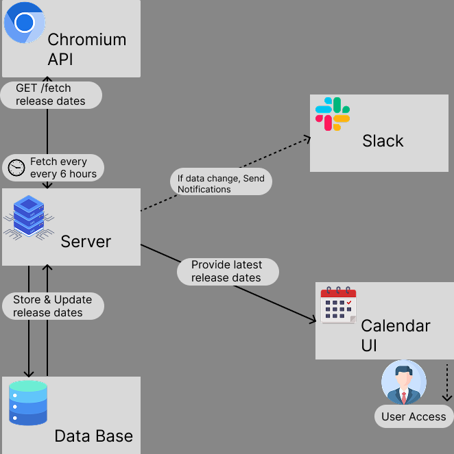
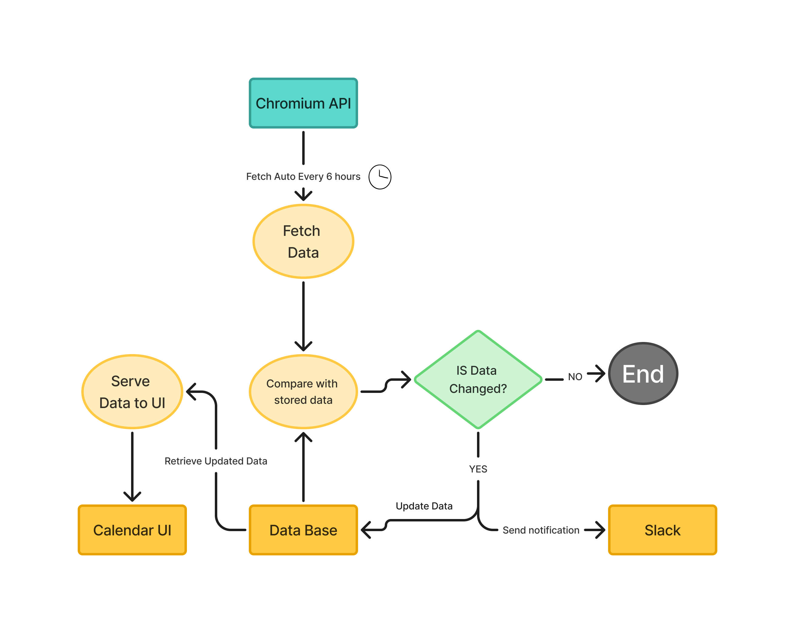

# gsoc-2025-proposal
Google Summer of Code (GSoC) 2025 proposal and research for the Electron project:  "Releases Working Group Calendar Website." This repository contains the project  proposal, architecture diagrams, and related documentation.

# System Architecture Diagram

This diagram illustrates the workflow of the **Releases Working Group Calendar Website**:
- **Server** fetches data from **Chromium API** every 6 hours.
- If dates change, **Slack notifications** are sent.
- The latest dates are stored in the **Database** and served to the **Calendar UI**.

The following Data Flow Diagram illustrates how data is fetched, stored, compared, and updated in the system.

